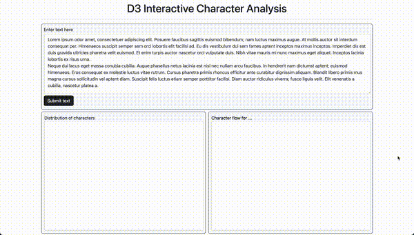

# D3 Interactive Character Analysis

An interactive data visualization built with D3.js to explore character frequency and sequence relationships within user-submitted text. This tool features a hierarchical treemap for character distribution and a linked Sankey diagram for character flow analysis, enabling users to gain insights into character occurrences, groupings, and contextual flow within text.

Here's a short demo of the project in action:



## Project Overview

This D3.js visualization tool provides an intuitive interface for analyzing the structure of text. Users can input any text into the text box, and upon submission, view two types of visualizations:

1. **Treemap**: Shows the distribution and frequency of characters (vowels, consonants, and punctuation) within the text.
2. **Sankey Diagram**: Displays the flow of character sequences based on user interactions with the treemap, allowing for deeper exploration of how characters relate to one another in context.

### Key Features

- **Dynamic Data Parsing**: Transforms user-entered text into a structured dataset for visualization.
- **Interactive Treemap**: Groups characters into vowels, consonants, and punctuation, with each rectangle sized by character frequency and colored by group.
- **Linked Sankey Diagram**: Shows character sequences for a selected character, highlighting which characters commonly precede or follow it.
- **Tooltips**: Displays character details upon hover for both visualizations.

## Visualization Details

### Treemap Chart
- **Grouping**: Characters are grouped by type:
  - **Vowels** (`a, e, i, o, u, y`)
  - **Consonants** (all other alphabetical characters)
  - **Punctuation** (`.,!?:;`)
- **Sizing and Color**: Each rectangle’s size represents the character’s frequency. Vowels, consonants, and punctuation are assigned unique colors for easy distinction.
- **Tooltip**: When hovering over a character, a tooltip displays the character name and its count within the text.
- **Interactivity**: Clicking on a character rectangle triggers the Sankey diagram for further exploration.

### Sankey Diagram
- **Flow Visualization**: Shows characters in context relative to a selected character:
  - **Left Column**: Characters immediately preceding the selected character.
  - **Middle Column**: The selected character, sized by its frequency.
  - **Right Column**: Characters immediately following the selected character.
- **Dynamic Updates**: The Sankey diagram regenerates each time a different character is clicked in the treemap.
- **Text Display**: A title updates dynamically to show the selected character for contextual clarity.

## How It Works

1. **Enter Text**: Type or paste text into the text box in the top panel and press "Submit."
2. **View Treemap**: The treemap in the bottom-left panel displays the distribution of characters based on frequency.
3. **Explore with Sankey Diagram**: Click a rectangle in the treemap to generate a Sankey diagram in the bottom-right panel. This diagram visualizes the contextual flow of characters relative to the selected character.
4. **Hover for Details**: Tooltips appear when hovering over characters in both the treemap and Sankey diagram, providing additional context about each character’s frequency and connections.

## Technical Implementation

- **D3.js**: Used to create both the treemap and Sankey diagram visualizations.
- **Data Parsing**: JavaScript processes the input text, identifying and counting vowels, consonants, and punctuation characters.
- **Hierarchical Data**: The treemap leverages a hierarchical data structure to group characters, with D3’s `treemap` function defining rectangle positions and sizes based on frequency.
- **Character Flow Analysis**: The Sankey diagram utilizes the `d3-sankey` library to construct a flow chart that visualizes character context within the text, showing characters that frequently precede or follow the selected character.

## Hosting the Project Locally

To host this project on your local machine, follow these steps:

### Prerequisites
- Visual Studio Code (VSCode)
- Git installed on your system

### Steps

1. **Clone the Repository**:
   - Open your terminal and run the following command:
   ```
   bash
   git clone https://github.com/SharanB7/D3-Interactive-Character-Analysis.git 
   ```

2. **Open the Project in VSCode**:
   - Navigate to the project directory and open it in VSCode:
   ```
   cd D3-Interactive-Character-Analysis
   code .
   ```

3. **Install the "Live Server" Extension**:
   - Open Visual Studio Code.
   - Go to the Extensions tab or press `Ctrl+Shift+X` (Windows/Linux) / `Cmd+Shift+X` (Mac).
   - Search for "Live Server" and install it.

4. **Run the Project**:
   - Locate and open `index.html` in your project folder.
   - Right-click on the file and select "Open with Live Server".
   - Alternatively, click on the "Go Live" button at the bottom right corner of VSCode.

The project should now be hosted locally and accessible at `http://127.0.0.1:5500` (or another port specified by Live Server).